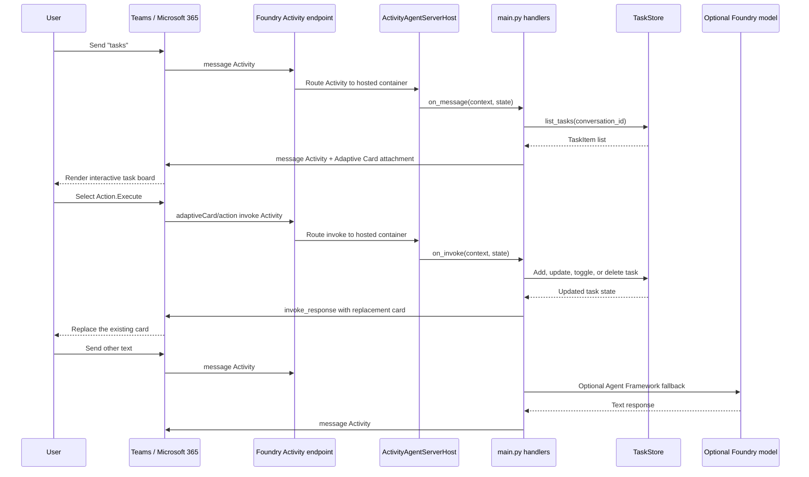

# Adaptive Card CRUD hosted agent

This repository deploys a Microsoft Foundry hosted agent into an **existing**
Foundry project. The agent renders an interactive task board as an Adaptive
Card and supports create, read, update, and delete operations.

The deployment path does not create or modify Foundry infrastructure. It
validates the target project, configures local `azd` environment state, and
deploys only the hosted-agent code.

## Architecture

- `azure-ai-agentserver-activity` hosts the Microsoft 365 Activity protocol.
- The Microsoft 365 Agents SDK sends cards and receives
  `adaptiveCard/action` invokes.
- Microsoft Agent Framework provides an optional conversational fallback when
  Foundry model settings are configured.
- `TaskStore` uses writable ephemeral storage under `/tmp` in the hosted
  runtime. Task data can be lost when the container or session is replaced and
  is not a durable multi-replica database.

## Adaptive Card and protocol flow

This agent exposes the **Activity protocol**, not the OpenAI-compatible
Responses protocol. The distinction matters because Teams and Microsoft 365
send Bot Framework-style activities, including the special invoke activities
produced by Adaptive Card actions.



### Sending the card

1. `azure.yaml` declares only the `activity` protocol for the hosted agent.
   After deployment, Foundry exposes an Activity endpoint for that agent.
2. Publishing the agent to Teams or Microsoft 365 configures the channel to
   deliver user traffic to that Activity endpoint.
3. `ActivityAgentServerHost` from `azure-ai-agentserver-activity` runs the HTTP
   server, readiness endpoint, authentication integration, and Activity
   dispatch used by the hosted container.
4. `main.py` registers `@app.activity("message")`. When the user sends
   `tasks`, `_send_tasks_card` asks `TaskStore` for that conversation's tasks.
5. `cards.py` builds the Adaptive Card as a normal Python dictionary and wraps
   it in a Microsoft 365 Agents SDK `Attachment` with content type
   `application/vnd.microsoft.card.adaptive`.
6. `context.send_activity(...)` sends a message Activity containing the
   attachment. Teams receives the Activity and renders the JSON as native UI;
   the Python service does not render HTML.

### Handling card actions

The card uses `Action.Execute` for add, save, complete, reopen, delete, and
refresh operations.

- Teams gathers the relevant card inputs and combines them with the action's
  `verb` and `data`.
- Teams sends an invoke Activity named `adaptiveCard/action` to the same
  Activity endpoint.
- `@app.activity("invoke")` routes the request to `on_invoke`.
- `cards.parse_action` reads the verb and submitted values.
- `_apply_action` performs the deterministic CRUD operation against
  `TaskStore`. Model inference is not involved.
- The handler returns an `invoke_response` whose body contains a newly built
  card. Teams uses that response to replace the existing card in place.

Tasks are partitioned by the Activity conversation ID. The current JSON store
is deliberately demo-only and uses ephemeral hosted storage, so it is not
suitable for durable or multi-replica production state.

### Activity versus Responses

| Concern | Activity protocol | Responses protocol |
|---|---|---|
| Intended clients | Teams, Microsoft 365, Bot Framework-compatible channels | OpenAI-compatible API clients and custom applications |
| Hosted route | Agent Activity protocol endpoint | `POST /responses` |
| Request shape | Activities such as `message`, `invoke`, and `conversationUpdate` | OpenAI Responses API JSON |
| Adaptive Card actions | Native `adaptiveCard/action` invoke flow | No native card-action invoke contract |
| Streaming and conversation API | Determined by the channel and Activity SDK | JSON or SSE with Responses conversation semantics |
| This repository | Implemented and declared in `azure.yaml` | Not exposed |

A hosted agent can expose more than one protocol, but each declared protocol
must also have a matching server adapter in the application. Adding a
Responses endpoint would provide a separate OpenAI-compatible API surface; it
would not replace the Activity handler required for the Adaptive Card
`Action.Execute` flow.

The `FoundryChatClient` in `agent_service.py` is easy to confuse with a hosted
Responses endpoint. It is instead an **outbound model client** used only for
the optional conversational fallback:

- `tasks`, card rendering, and all card CRUD operations use deterministic
  Activity handlers and work without a model.
- Other text can be passed to Microsoft Agent Framework when
  `FOUNDRY_PROJECT_ENDPOINT` and `AZURE_AI_MODEL_DEPLOYMENT_NAME` are set.
- That model response is converted back into a normal message Activity before
  it is returned to Teams.

### Framework and package responsibilities

| Component | Required for this sample? | Responsibility |
|---|---:|---|
| Microsoft Foundry hosted-agent runtime | Yes | Hosts and scales the deployed Python service and exposes the declared protocol endpoint |
| `azure-ai-agentserver-activity` | Yes | Implements the hosted Activity server contract and dispatches Activities |
| Microsoft 365 Agents SDK packages | Yes | Supplies Activity, Attachment, invoke-response, hosting, and authentication types |
| Adaptive Cards SDK | No | The card is plain JSON assembled in `cards.py`; Teams renders it |
| Microsoft Agent Framework | No for cards; optional for fallback | Sends non-card conversational text to the configured Foundry model |
| `azure-identity` | Only for model fallback | Provides `DefaultAzureCredential` for the outbound model client |
| `TaskStore` | Demo implementation | Applies deterministic CRUD and persists per-conversation state to ephemeral JSON storage |

## Prerequisites

- PowerShell 7
- Python 3.10 or later
- Azure CLI authenticated to the tenant that owns the existing project
- Azure Developer CLI with the `azure.ai.agents` extension
- Permission to read the existing project and deploy hosted agents

## Configure the target project

Copy the environment template:

```powershell
Copy-Item .\src\adaptive-card-agent\.env.example .\src\adaptive-card-agent\.env
```

Set `FOUNDRY_PROJECT_ENDPOINT` to the existing project endpoint. Set
`AZURE_AI_MODEL_DEPLOYMENT_NAME` only when conversational fallback should use a
model; Adaptive Card CRUD does not require one.

## Run the local playground demo

From the repository root, start the Activity-protocol agent with:

```powershell
$env:AZURE_DEV_USER_AGENT = "microsoft_foundry_skill"
azd ai agent run adaptive-card-agent
```

This opens Microsoft 365 Agents Playground and starts the agent on
`http://localhost:8088`. Send `tasks` to render the interactive task board,
then use its create, edit, complete, reopen, and delete actions.

The card demo works without a model deployment. Configure
`FOUNDRY_PROJECT_ENDPOINT` and `AZURE_AI_MODEL_DEPLOYMENT_NAME` in
`src\adaptive-card-agent\.env` only to enable conversational fallback.
Use `Ctrl+C` to stop the local agent.

## Validate and deploy

The publishing script reads local defaults from
`src\adaptive-card-agent\.env`, validates the existing project through Azure
Resource Manager, configures a local azd environment, and deploys only the
hosted-agent code. It never runs `azd provision` or `azd up`.

```powershell
.\scripts\publish-existing.ps1
```

Override values when needed:

```powershell
.\scripts\publish-existing.ps1 `
  -EnvironmentName "adaptive-card-demo" `
  -ProjectEndpoint "https://<account>.services.ai.azure.com/api/projects/<project>" `
  -ModelDeploymentName "<deployment-name>"
```

Use `-SubscriptionId` to narrow project discovery or `-ProjectId` when the
project is not readable through the management plane. Creating a local azd
environment does not create Azure resources.

Validate project discovery without changing azd state or deploying:

```powershell
.\scripts\publish-existing.ps1 -ValidateOnly -SkipChecks
```

Run formatting, linting, type checks, and tests independently with:

```powershell
.\scripts\check.ps1
```

After deployment:

1. Confirm the reported agent status is `active` or `deployed`.
2. Follow `src\adaptive-card-agent\TEAMS_APP_SETUP.md` if azd generates it.
3. In the Foundry portal, publish the agent to Teams and Microsoft 365 Copilot
   using **Just you** for the first test.
